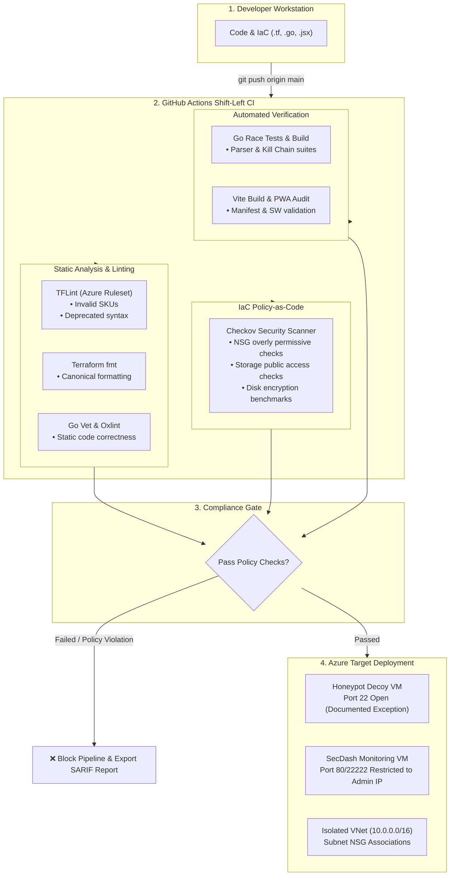
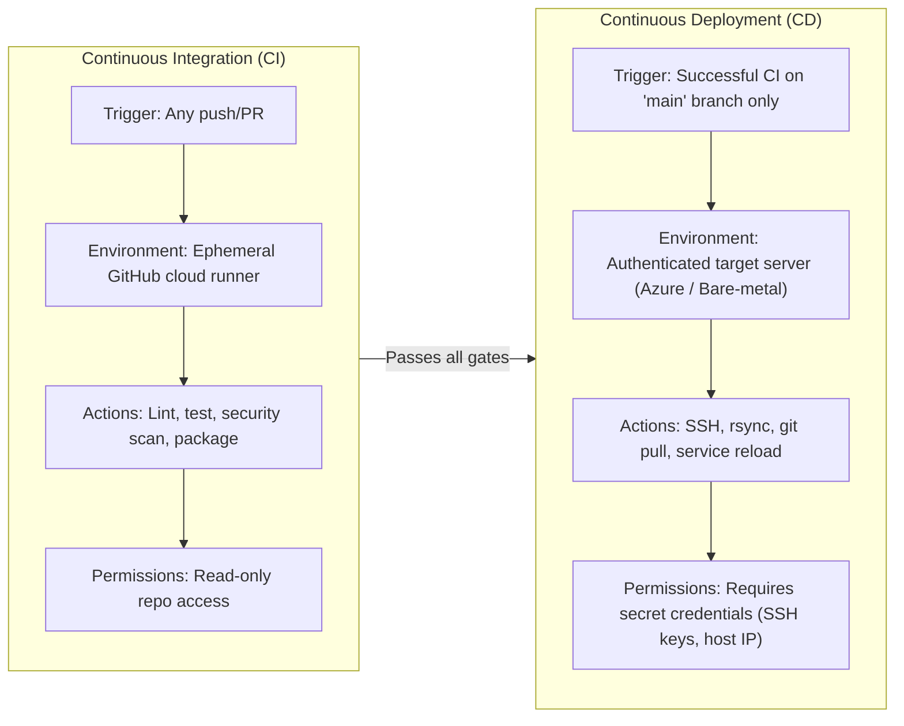

# SecDash — Enterprise Cowrie Honeypot Threat Operations Center

[](https://github.com/vadehraatharv7-hub/sec_dash/actions/workflows/ci.yml)

A high-performance security dashboard, real-time logstream, and threat intelligence engine designed specifically for **Cowrie SSH/Telnet honeypots**. 

Built with a **Golang backend** for ultra-high throughput (~3.7x higher than FastAPI/Node.js, sub-millisecond query latency) and an enterprise **React 19 + Tailwind CSS** Security Operations Center (SOC) frontend.

Replaces the Grafana/Loki pipeline with direct, low-latency ingestion via Grafana Alloy.

---

## ⚡ Key Capabilities & Architecture

### 1. The Real-Time Terminal Stream (WebSockets)
- Tailing raw honeypot events in real-time over WebSockets (`ws://localhost:8080/ws`).
- Structured audit logs displaying timestamps, event IDs, source IPs, target ports, credentials, and executed commands.
- Includes **grep regex filtering**, severity level selector (`CRITICAL`, `HIGH`, `WARN`, `INFO`), **autoscroll lock/free**, and one-click `.log` file export.

### 2. The Credential Harvesting Wall
- Complete credential intelligence matrix aggregating all attempted username:password combinations.
- Real-time brute-force volume counters and complexity/entropy classification (Trivial/Default vs Dictionary).
- One-click **"Export Wordlist (.txt)"** button to export discovered credentials for firewall blocklists and password audit dictionaries.

### 3. Attack Velocity & Threat Counters
- Executive threat counters:
  - **Attack Velocity & Throughput**
  - **Compromise Ratio (%)**: Ratio of sessions that successfully breached authentication into the honeypot sandbox
  - **Adversary Routing**: Unique Autonomous System Numbers (ASNs)
  - **Intercepted Shell Commands**
  - **Captured Loot Payloads**
  - **Average Adversary Session Dwell Time**

### 4. Payload Extraction (The "Loot" Tab)
- Isolated sandbox vault for malware binaries and shell scripts dropped via `wget`, `curl`, or `tftp`.
- Computes SHA-256 and MD5 hashes with one-click copy.
- Automatic architecture detection (e.g. `ELF 32-bit ARM (IoT)`, `ELF 32-bit MIPS (Router)`, `POSIX Shell Script`).
- Integrated **VirusTotal lookup** and **Decompilation Strings Preview** drawer.

### 5. IP Geolocation Heatmap & Global Sensor Radar
- Interactive **Leaflet map** rendered with **CartoDB Dark Matter** dark-mode tiles.
- Vector markers for active threat origin hotspots with attack volume radius scaling.
- Trajectory arcs connecting adversary locations directly to the Honeypot sensor node.
- Real-time country leaderboard with search filter and click-to-center navigation.

### 6. LLM-Powered Threat Profiling ("AI Analysis")
- Route completed adversary session transcripts through an automated threat triage engine.
- An **"AI Analysis"** button next to each recorded session.
- Classifies:
  - **Attacker Intent & Primary Objective** (e.g., *Cryptomining Botnet Deployment*, *Host Fingerprinting*, *Mirai/Mozi IoT Dropper*)
  - **Skill Level Assessment** (*Automated Worm*, *Script Kiddie*, *Skilled Intruder*, *APT*)
  - **Confidence Score & Threat Category**
  - **MITRE ATT&CK TTP Mapping** with evidentiary shell commands
  - **Actionable Remediation & Defense Advice**
- Seamlessly uses **Google Gemini 1.5 Flash** if `GEMINI_API_KEY` is provided, with an intelligent built-in cybersecurity heuristic engine fallback.

### 7. Botnet Fingerprinting (HASSH & Client Strings)
- Tracks and groups SSH client version banners (`cowrie.client.version`).
- Classifies botnet families:
  - *Libssh Automated Scanner*
  - *Paramiko Python Brute-Forcer*
  - *Go-Based Mirai/Dropper Variant*
  - *PuTTY Manual Intrusion*
  - *Masscan Port Sweeper*
- Displays fleet percentage share, first seen, and last seen timestamps.

### 8. The "Kill Chain" Session Timeline
- Visual 7-phase **Cyber Kill Chain** progression modal for any recorded session:
  1. *Reconnaissance* (Port scanning / banner grabbing)
  2. *Weaponization & Delivery* (Credential stuffing)
  3. *Exploitation* (Initial access / pseudo-terminal allocated)
  4. *Discovery & Enumeration* (`uname -a`, `cpuinfo`, `id`, `whoami`)
  5. *Ingress Tool Transfer* (`wget`, `curl -O`, payload download)
  6. *Execution & Persistence* (`chmod +x`, `crontab`, background execution)
  7. *Defense Evasion & Action on Objective* (`rm -rf`, `history -c`, `iptables -F`)
- Clear status badges (`ACHIEVED`, `BLOCKED`, `INACTIVE`) with timestamps and command evidence.

### 9. Custom Webhook Alerting Engine
- Configure instant webhook alerts for **Slack**, **Discord**, and **Generic JSON endpoints**.
- Granular triggers:
  - Alert on Shell Breach (`cowrie.login.success`)
  - Alert on Malware Dropped (`cowrie.session.file_download`)
  - Alert on Critical Ingress Commands (`wget`, `curl | sh`, `rm -rf`)
- Diagnostic test ping button and real-time dispatch audit logs with HTTP response codes.

---

## 🚀 Getting Started

### 1. Launch the Stack
```bash
./dev.sh
```
or
```bash
make run
```

- **Frontend Dashboard**: [http://localhost:5173](http://localhost:5173)
- **Backend Ingestion API**: `http://localhost:8080`
- **Real-Time WebSocket Feed**: `ws://localhost:8080/ws`

### 2. Connect Grafana Alloy
In your Grafana Alloy configuration (`/etc/alloy/config.alloy` or `backend/alloy/config.alloy`):

```alloy
local.file_match "cowrie_logs" {
  path_targets = [{
    __path__ = "/var/log/cowrie/cowrie.json*",
    app      = "cowrie",
  }]
  sync_period = "5s"
}

loki.source.file "cowrie_collector" {
  targets    = local.file_match.cowrie_logs.targets
  forward_to = [loki.write.secdash.receiver]
}

loki.write "secdash" {
  endpoint {
    url = "http://127.0.0.1:8080/api/ingest/loki"
  }
}
```

Then run Alloy:
```bash
alloy run backend/alloy/config.alloy
```

---

## 📚 Study Material: Cloud Security & DevSecOps Engineering

This repository incorporates enterprise **DevSecOps practices** to secure cloud infrastructure, automate code verification, and enforce security policies. Below is an engineering study guide covering the core concepts implemented in this platform.



---

### 1. DevSecOps & The "Shift-Left" Philosophy

In traditional infrastructure management, security reviews occurred late in the deployment cycle—often after resources were already provisioned in Azure. Remedying security flaws in live production environments is costly, risks service disruptions, and leaves a window of exposure.

* **Shift-Left Security**: Moving security validations as early as possible in the software delivery lifecycle (SDLC).
* **Automated Feedback Loop**: Developers receive instantaneous feedback on security misconfigurations directly in Pull Requests via CI status checks before terraform code touches Azure APIs.
* **SARIF Integration**: Static Analysis Results Interchange Format (SARIF) reports are generated on every run, enabling standardized security reporting and automated vulnerability tracking.

---

### 2. Infrastructure as Code (IaC) Scanning with Checkov

[Checkov](https://www.checkov.io/) is an industry-standard static code analysis tool for Infrastructure as Code (IaC). It evaluates Terraform, ARM templates, Kubernetes manifests, and Dockerfiles against thousands of security policies derived from standards such as **CIS Benchmarks**, **NIST 800-53**, and **PCI-DSS**.

#### Critical Azure Security Policies Scanned in This Pipeline:

| Policy ID | Severity | Policy Title | Threat Vector Prevented |
| :--- | :--- | :--- | :--- |
| `CKV_AZURE_9` | **High** | Ensure SSH access is restricted from the internet | Prevents exposing management SSH ports (`22`, `22222`) to `0.0.0.0/0` across entire networks. |
| `CKV_AZURE_10` | **High** | Ensure RDP access is restricted from the internet | Prevents automated brute-force worms from accessing Windows remote desktop ports (`3389`). |
| `CKV_AZURE_35` | **High** | Ensure default network access for Storage Accounts is Deny | Prevents cloud storage buckets from being globally accessible without firewall whitelisting. |
| `CKV_AZURE_59` | **Critical** | Ensure Storage Accounts disallow public access | Stops unauthorized extraction of sensitive forensics, binary dumps, or log archives. |
| `CKV_AZURE_44` | **Medium** | Enforce minimum TLS 1.2 on storage accounts | Protects telemetry logs in transit from downgrade and eavesdropping attacks. |
| `CKV2_AZURE_31` | **Medium** | Ensure VNet subnet is configured with an NSG | Prevents lateral movement across unsegmented subnets within an Azure Virtual Network. |
| `CKV_AZURE_149` | **High** | Ensure Linux VMs disable password authentication | Enforces SSH key-pair authentication over weak, brute-forceable user passwords. |

---

### 3. The Honeypot Threat Modeling Paradox: Handling Intentional Decoys

A unique challenge in cybersecurity engineering is that **honeypots deliberately violate baseline security benchmarks** by design. 

For example, a honeypot *must* expose port 22 to the public internet (`*` or `0.0.0.0/0`) to attract adversary traffic. Standard security linters will immediately flag this as a critical vulnerability (`CKV_AZURE_9`).

#### The DevSecOps Solution: Policy-as-Code Suppressions with Justification

Rather than disabling security checks globally, enterprise DevSecOps relies on **granular, documented policy exceptions**:

```hcl
# In terraform/main.tf
resource "azurerm_network_security_group" "nsg" {
  name                = "nsg-honeypot-firewall"
  location            = azurerm_resource_group.rg.location
  resource_group_name = azurerm_resource_group.rg.name

  # checkov:skip=CKV_AZURE_9:Port 22 is deliberately exposed to the internet as a Cowrie honeypot decoy sensor
  # checkov:skip=CKV_AZURE_10:Port 22 is open for decoy honeypot attack capture
  security_rule {
    name                       = "allow-decoy-port"
    priority                   = 100
    direction                  = "Inbound"
    access                     = "Allow"
    protocol                   = "Tcp"
    source_port_range          = "*"
    destination_port_range     = "22"
    source_address_prefix      = "*"
    destination_address_prefix = "*"
  }

  # Management port remains strictly hardened and NEVER skipped:
  security_rule {
    name                       = "Allow-Admin-SSH"
    priority                   = 110
    direction                  = "Inbound"
    access                     = "Allow"
    protocol                   = "Tcp"
    source_port_range          = "*"
    destination_port_range     = "22222"
    source_address_prefix      = var.admin_public_ip # Strictly locked to your IP
    destination_address_prefix = "*"
  }
}
```

* **Golden Rule**: Suppress security rules *only* on decoy sensor interfaces, and **never** on actual administrative management surfaces (e.g. port 22222, internal telemetry APIs, or cloud storage buckets).

---

### 4. Deep Static Linting with TFLint & Azure Ruleset

While `terraform validate` verifies basic HCL syntax, it does not understand cloud-provider-specific rules. **TFLint** analyzes the Abstract Syntax Tree (AST) of Terraform configurations and applies deep provider semantics.

#### What TFLint Catches:
* **Invalid Resource SKUs**: Verifies VM sizes (e.g. `Standard_B1s`) against actual supported Azure compute offerings.
* **Deprecated Provider Attributes**: Identifies deprecated AzureRM resource arguments before breaking provider upgrades.
* **Configuration Anti-patterns**: Detects unreferenced variables, duplicated blocks, and missing required provider configuration blocks.

#### Configuration ([`.tflint.hcl`](file:///home/marcos_007/Documents/project/sec_dash/terraform/.tflint.hcl)):
```hcl
plugin "terraform" {
  enabled = true
  preset  = "recommended"
}

plugin "azurerm" {
  enabled = true
  version = "0.27.0"
  source  = "github.com/terraform-linters/tflint-ruleset-azurerm"
}
```

---

### 5. CI vs. CD: Understanding the Pipeline Architecture

A common point of confusion in modern DevOps is distinguishing between **Continuous Integration (CI)** and **Continuous Deployment (CD)**:



#### Why CI Cannot Deploy Automatically Without Secrets
* GitHub Actions runners are ephemeral, stateless virtual machines in Microsoft's Azure cloud. They have no inherent network route or credentials to authenticate to your specific honeypot server.
* To bridge the gap, **GitHub Secrets** (`SERVER_HOST`, `SERVER_SSH_KEY`, `SERVER_USER`) provide the encrypted credentials needed for an SSH deployment step.
* This security boundary prevents unreviewed pull requests or fork PRs from triggering malicious deployments to production servers.
